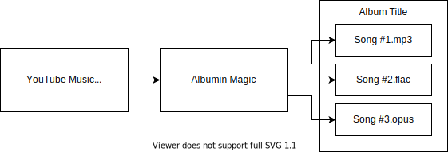

<html>
    <h1 align='center'>
        Gunloader
    </h1>
    <p align='center'>
        Download, extract & curate songs from YouTube album videos in your favourite audio format.
        <br>
        <br>
        
        <br>
        
        <br>
        <a href='https://github.com/yumiris/Gunloader/releases/latest'>Download Latest Release</a>
    </p>
</html>

## Introduction

This project allows you to transform long YouTube album videos into properly curated songs, with support for popular audio formats. It's not just for YouTube, but any website that YouTube-DL supports, and any video/audio that FFmpeg supports.



## Features

- Encodes a long video's audio into separate audio tracks
- Support for FLAC, MP3, Vorbis and Opus encoding formats
- Tagging abilities (title, album, artist(s), comment, genre, etc.)
- Downloading using YouTube-DL, or using an existing video file
- Embedded cover art, using thumbnails derived from the provided video, or using an existing image
- Batch processing of multiple album videos from YouTube or local videos
- Song information can be read from a file, or from a YouTube video's chapters/timeline
- Optional lossless splitting of the video's original audio, without any re-encoding whatsoever

## Usage

First, create the records file as described [#album-records](here). Once you're done, invoke the program:

```shell
./gunloader \
    # records file
    --album '~/album.txt' \
    --album '~/another-album.txt' \

    # encoding of choice (default is mp3)
    --format flac \

    # losslessly split the original audio
    # no metadata or re-encoding is applied
    --format raw \

    # mass fill with optional metadata
    --genre "OP/ED/IN/IM" \
    --artist "Various" --artist "Artists" \
    --comment 'Very Important Music'
```

The program will first generate a [`.gun` file](./doc/compiling.md) describing the tracks. Feel free to review and edit each track's metadata and whatnot as necessary.

Once you're ready, continue with the program and it will start curating the video into separate songs.

### Parameters

| Parameter         | Description                                                                                                 |
| ----------------- | ----------------------------------------------------------------------------------------------------------- |
| `--format=VALUE`  | audio encoding format; supported values: `mp3`, `flac`, `vorbis`, `opus`, `raw`                             |
| `--album=VALUE`   | path to [#album-records](album records) file(s) (see below); multiple `--album 'abc.txt' --album 'xyz.txt'` |
| `--artist=VALUE`  | album artist(s) to assign to the tracks' metadata; multiple: `--artist 'a' --artist 'b'`                    |
| `--genre=VALUE`   | genre to assign to the tracks' metadata                                                                     |
| `--comment=VALUE` | comment to assign to the tracks' metadata                                                                   |
| `--cover=VALUE`   | optional path to album art image for assigning to songs                                                     |

Additional parameters can be found using `--help`.

## Album Records

The [records](./doc/album.md) file contains the main album information:

- The **first two lines** specify the **album title** and **video source**. The video source can be either a YouTube URL or a local video file.
- **Subsequent lines represent the tracks**. Each line *must* comprise of the following attributes, in the given order and separated by spaces:
  1. Track number
  2. Starting time in the provided video
  3. Title of the track

```
90'sアニメ主題歌セレクション RB-XYZ【奇跡の向こう側へ】 Ver.2
https://youtu.be/divcisums90

01 0:00:00 All You Need Is Love - 田村直美 「レイアース」OVA版主題歌
02 0:05:20 HEAVEN - HIM 「YAT安心！宇宙旅行」一期OP
03 0:08:48 僕であるために - FLYING KIDS 「逮捕しちゃうぞ」一期OP2
04 0:12:23 LOVE SOMEBODY - 福井麻利子 「逮捕しちゃうぞ」一期OP3
```

## YouTube Chapters

If you want Gunloader to attempt to use a YouTube video's chapter information for the songs, please:

1. Ensure the YouTube video in question has **chapters in its timeline**; and
2. Create a [records](./doc/album.md) file containing a **YouTube video URL** in the **first line**!

## Installation

Download [the latest release from here](https://github.com/yumiris/Gunloader/releases/latest), and also make sure you have the dependencies you need installed. See below for further information!

## Dependencies

- [`youtube-dl`](https://ytdl-org.github.io/youtube-dl/) for downloading videos
- [`ffmpeg`](https://www.ffmpeg.org/) for audio & cover art extraction
- [`lame`](https://lame.sourceforge.net/) for MP3 encoding w/ metadata
- [`flac`](https://xiph.org/flac/) for FLAC encoding w/ metadata
- [`oggenc`](https://www.xiph.org/vorbis/) for Vorbis encoding w/ metadata
- [`opusenc`](https://wiki.xiph.org/Opus-tools) for Opus encoding w/ metadata

If you need to specify a dependency's executable to the program, do it like so:

```shell
./gunloader \
    # records file
    --album '~/album.txt' \

    # paths to dependencies
    --ffmpeg "c:\\ffmpeg.exe" \
    --flac '/bin/flac' \
    --youtube-dl ~/ytdl \

    # mass fill with optional metadata
    --genre "OP/ED/IN/IM" \
    --artist "Various" --artist "Artists" \
    --comment 'Very Important Music'
```

## FAQ

It's called `gunloader` because it was originally meant to be used to download compilations by Gundober.

This repository's numbskull of an author realised only afterwards that this solution works for any YouTube album video.
