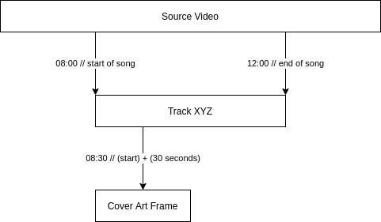

# Cover Art

Before creating the encoded file, Gunloader will instruct FFmpeg to extract an image of a frame from the source video. It will use the image as a cover art for the encoded audio file.

The frame of the cover art will always be **30 seconds** after the **start** of the song in the video:

If an existing local image is assigned as the [track](./track.md)'s cover art in its [metadata](./metadata.md), then the aforementioned extracting process will be skipped.