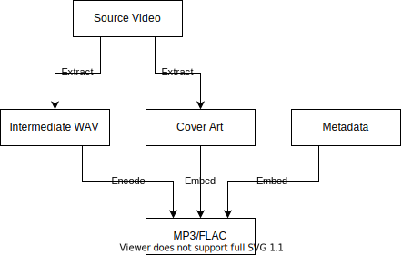

# Encoding Process

The encoding process creates an audio file of a [track](./track.md) using the chosen format (MP3 by default). It encodes its [intermediate audio file](./intermediate.md) along with the [cover art](./cover.md) and any given [track metadata](./track.md):

| Format     | Dependency |
| ---------- | ---------- |
| MP3        | `lame`     |
| FLAC       | `flac`     |
| Ogg Vorbis | `oggenc`   |
| Ogg Opus   | `opusenc`  |
| RAW^0      | `ffmpeg`   |

^0 = RAW refers to lossless splitting of the video's original audio stream into separate tracks, without any re-encoding whatsoever. Everything described above gets skipped when using this encoding "format".