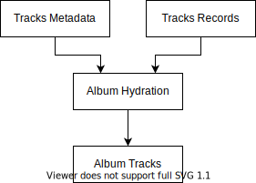

# Hydration Process

In wacky Albumin lingo, hydration refers to assigning [album](./album.md) property values, using data from the given [album record](./album.md) and [track metadata](./track.md) objects:

Hydration is a part of the [compiling](./compiling.md) procedure.